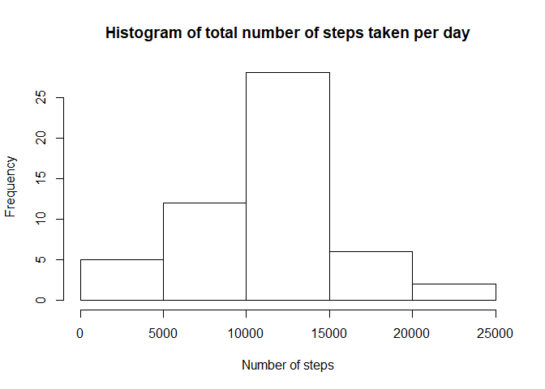
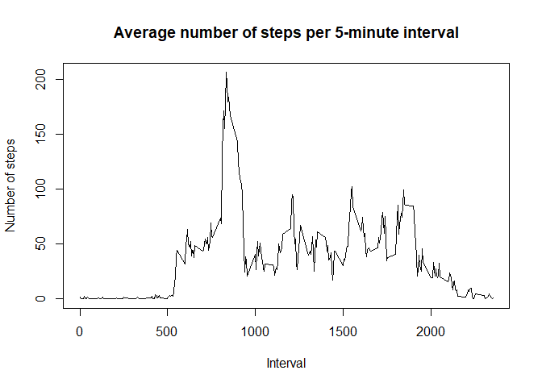
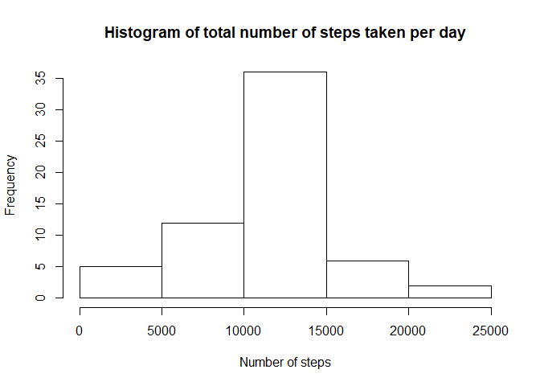
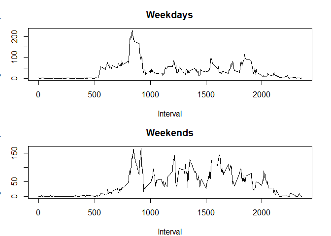

## R Markdown

This is the programming assignment that belongs to the first course project on Reproducible Research.


```r
library(base)
```

## Loading and preprocessing the data


```r
unzip(zipfile = "activity.zip")
activity <- read.csv(file = "activity.csv", header = TRUE, sep = ",")
activity$date <- as.Date(activity$date)
```

## What is mean total number of steps taken per day?


```r
total.steps <- aggregate(steps ~ date, activity, FUN = sum)

hist(total.steps$steps, xlab = "Number of steps",
     main = "Histogram of total number of steps taken per day")
```

<!-- -->

```r
mean.steps <- mean(total.steps$steps)
mean.steps
```

```
## [1] 10766.19
```

```r
median.steps <- median(total.steps$steps)
median.steps
```

```
## [1] 10765
```

## What is the average daily activity pattern?


```r
average.steps <- aggregate(steps ~ interval, activity, FUN = mean)

plot(x = average.steps$interval, y = average.steps$steps, type = "l",
     xlab = "Interval", ylab = "Number of steps",
     main = "Average number of steps per 5-minute interval")
```

<!-- -->

```r
max <- which.max(average.steps$steps)

average.steps[max,]
```

```
##     interval    steps
## 104      835 206.1698
```
This is the interval from 8.35 - 8.40 am.

## Imputing missing values


```r
summary(activity)
```

```
##      steps             date               interval     
##  Min.   :  0.00   Min.   :2012-10-01   Min.   :   0.0  
##  1st Qu.:  0.00   1st Qu.:2012-10-16   1st Qu.: 588.8  
##  Median :  0.00   Median :2012-10-31   Median :1177.5  
##  Mean   : 37.38   Mean   :2012-10-31   Mean   :1177.5  
##  3rd Qu.: 12.00   3rd Qu.:2012-11-15   3rd Qu.:1766.2  
##  Max.   :806.00   Max.   :2012-11-30   Max.   :2355.0  
##  NA's   :2304
```

```r
new.activity <- activity
new.average.steps <- average.steps
colnames(new.average.steps) <- c("interval", "average.steps")
merged.data <- merge(new.activity, new.average.steps, by = "interval")
merged.data$steps <- ifelse(is.na(merged.data$steps),
                            merged.data$average.steps, merged.data$steps)

merged.data <- merged.data[with(merged.data, order(date)),] # order by date
total.steps.new <- aggregate(steps ~ date, merged.data, FUN = sum)
hist(total.steps.new$steps, xlab = "Number of steps",
     main = "Histogram of total number of steps taken per day")
```

<!-- -->

```r
mean.steps.new <- mean(total.steps.new$steps)
mean.steps.new
```

```
## [1] 10766.19
```

```r
median.steps.new <- median(total.steps.new$steps)
median.steps.new
```

```
## [1] 10766.19
```
There are 2304 NA's.
The values from average.steps for the belonging interval are used for replacing the NA's.

There is no impact on the mean value, but a slight impact on the value for the median, which now equals the mean value, because quantiles are changing.
Sure there would be an impact of imputing missing data on the estimates of the total daily number of steps if data would be replaced e.g. by zeros.

## Are there differences in activity patterns between weekdays and weekends?


```r
weekdays <- weekdays(merged.data$date)
daylevel <- ifelse(weekdays %in% c("Samstag", "Sonntag"), "weekend", "weekday")
merged.data <- cbind(merged.data, daylevel)

weekday.data <- merged.data[merged.data$daylevel == "weekday",]
average.steps.weekday <- aggregate(steps ~ interval, weekday.data, FUN = mean)

weekend.data <- merged.data[merged.data$daylevel == "weekend",]
average.steps.weekend <- aggregate(steps ~ interval, weekend.data, FUN = mean)

par(mfrow = c(2,1))
par(mar = c(4, 3, 3, 2))
plot(x = average.steps.weekday$interval, y = average.steps.weekday$steps, type = "l",
     xlab = "Interval", ylab = "Average number of steps",
     main = "Weekdays")

plot(x = average.steps.weekend$interval, y = average.steps.weekend$steps, type = "l",
     xlab = "Interval", ylab = "Average number of steps",
     main = "Weekends")
```

<!-- -->

On weekdays there is much more movement in the morning, meanwhile on weekends it is quite equally distributed over the day.Upload of PA1_template.Rmd files
